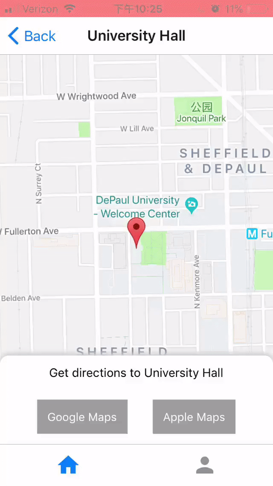

# Bottom drawer for React Native

<p align="center">
  
</p>

## Content

- [Installation](#installation)
- [Usage example](#usage-example)
- [Configuration](#configuration)
- [Questions?](#questions)

## Installation

Install `rn-bottom-drawer`.

```
npm install rn-bottom-drawer --save
```

## Usage Example
(go to the example folder for a more fleshed out example)

```javascript
import React from 'react';
import { View, Text } from 'react-native';
import BottomDrawer from 'rn-bottom-drawer';

const TAB_BAR_HEIGHT = 49;

export default class App extends React.Component {
  renderContent = () => {
    return (
      <View>
        <Text>Get directions to your location</Text>
      </View>
    )
  }

  render() {
    return (
      <BottomDrawer
        containerHeight={100}
        offset={TAB_BAR_HEIGHT}
      >
        {this.renderContent()}
      </BottomDrawer>
    )
  }
}

```
[Refer to this code](https://github.com/jacklein/rn-bottom-drawer/issues/7#issuecomment-465554054) if you want to put a **scrollview** within the bottom drawer

## Configuration

| Prop | Type | Default | Description |
| ---- | ---- | ----| ---- |
| containerHeight | number | -- | The height of the drawer. | 
| offset | number | 0 | If your app uses tab navigation or a header, **offset** equals their combined heights. In the demo gif, the offset is the header + tab heights so that the drawer renders correctly within the map view. |
| downDisplay | number | containerHeight / 1.5 | When the drawer is swiped into down position, **downDisplay** controls how far it settles below its up position. For example, if its value is 20, the drawer will settle 20 points below the up position. The default value shows 1/3 of the container (if containerHeight = 60, the default downDisplay value = 40). |
| backgroundColor | string | '#ffffff' | The background color of the drawer. |
| startUp | bool | true | If **true**, the drawer will start in up position. If **false**, it will start in down position. |
| roundedEdges | bool | true | If **true**, the top of the drawer will have rounded edges. |
| shadow | bool | true | if **true**, the top of the drawer will have a shadow. |
| onExpanded | func | -- | A callback function triggered when the drawer is swiped into up position |
| onCollapsed | func | -- | A callback function triggered when the drawer is swiped into down position |

### Questions?
Feel free to contact me at [jackdillklein@gmail.com](mailto:jackdillklein@gmail.com) or [create an issue](https://github.com/jacklein/rn-bottom-drawer/issues/new)
